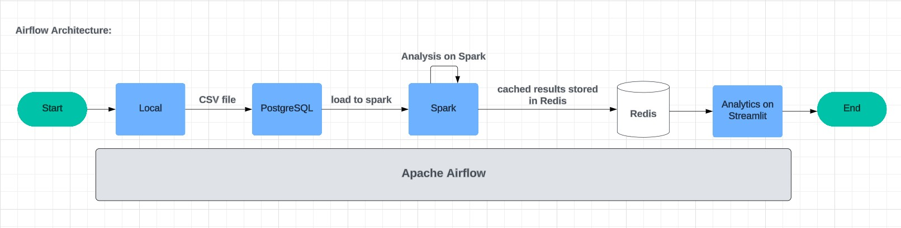

# E-commerce App Transactional Analysis Project

## Architecture Design

### 1. Old Architecture that was planned to be made:


### 2. Bulk Loading by HBase & Streaming Data by Kafka Architecture:


### 3. Airflow Architecture: 



# Architecture 1 : Analytics Using HBase Bulk Loading & Kafka Real Streaming Data

## Data

- Run Data/`import.py` to retrieve the original data source.
- Then run Data/`inc_size.py` and Data/`500mb.py` to increase the size of the data.

## Compose files

All compose files are in the `ComposeFiles` folder.

## Real-time Streaming

The schemas for each CSV file for Avro serialization are in the `Data/schemas` folder.

### Kafka to Spark Streaming

#### Kafka

- Use this container: `docker-kafka-sc6-kafka-1-1`.
- Break the larger data size file into chunks using `Data/breaking.py`.
- The code for the Kafka producer is in `Ingestion/real-time.py`.
- In Kafka, store the `schemas` folder and all CSV files in one location.
- For running the code, Python needs to be installed in the Kafka container and a virtual environment created.
- In the virtual environment, install the required packages, run the code, and specify the location where schema CSV files are stored.

#### Spark

- For Spark, store the `schemas` folder in `spark-master:/home`.
- Store `consumer.py` in `spark-master:/`.
- Then, in the Spark container, install Python 3.
- Instructions:
  ```sh
  export SPARK_HOME=/spark
  export PATH=$SPARK_HOME/bin:$PATH
  export PYSPARK_PYTHON=/usr/bin/python3
  spark-submit \
   --packages org.apache.spark:spark-sql-kafka-0-10_2.12:3.3.0 \
   consumer.py
  ```

### Spark to HBase Streaming

#### HBase

Create tables for all of them:

```sh
create 'customers', 'personal_info', 'device_info', 'location_info', 'join_info'
create 'clickstream', 'event_details', 'traffic_info', 'metadata'
create 'transactions', 'transaction_details', 'payment_info', 'shipment_info', 'transaction_summary'
create 'product', 'product_info', 'product_details', 'metadata'
```

#### Spark

- CSVs are in chunks after Kafka to Spark streaming. Copy all the files in the `sparkmerge` folder to `spark-master:/` and run them to merge these CSV files into one.
- Then, copy all codes in the `sparkhbase` folder and execute them.

#### HBase

The instructions for the execution of further steps from Spark to HBase in the HBase container are specified in the files of the `sparkhbase` folder as comments at the end of the code.

## Bulk Loading

- Use the HBase distributed compose file.
- Create tables:
  ```sh
  create 'customers', 'personal_info', 'device_info', 'location_info', 'join_info'
  create 'clickstream', 'event_details', 'traffic_info', 'metadata'
  create 'transactions', 'transaction_details', 'payment_info', 'shipment_info', 'transaction_summary'
  create 'product', 'product_info', 'product_details', 'metadata'
  ```
- Copy all the codes of `CSVToTable` in HBase and run them.
- Before executing these Java codes, do:
  ```sh
  export CLASSPATH=/path/to/hbase-1.2.6/lib/*
  ```

## Design

- Run `UI/design.py` locally.
- Ensure your Thrift server is started in HBase:
  ```sh
  hbase-daemon.sh start thrift
  ```


# Architecture 2 : Analytics Using Airflow

This repository contains 2 architectures for big data analytics. Below are the instructions for setting up and running the Airflow architecture located in the `analytics-using-airflow` folder.

---

## Setting Up the Airflow Architecture

1. **Download the Project Folder**
   - Download the `analytics-using-airflow.zip` file from this repository.

2. **Extract the Zip File**
   - Extract the contents of the `analytics-using-airflow.zip` file to your desired directory.
     - Recommended directory: `C:\Projects\Big-Data-Analytics-Project\`

3. **Unzip the `pg_data.zip` Folder**
   - Navigate to the extracted `analytics-using-airflow` folder.
   - Locate the `pg_data.zip` file inside it.
   - Extract the contents of `pg_data.zip` to the same directory:  
     `C:\Projects\Big-Data-Analytics-Project\analytics-using-airflow\`

     After extraction, your folder structure should look like this:
     ```
     analytics-using-airflow/
     ├── dags/
     ├── data/
     ├── logs/
     ├── pg_data/          <-- Unzipped contents here
     ├── plugins/
     ├── streamlit_app/
     ├── docker-compose.yml
     ├── Dockerfile
     └── pg_data.zip       <-- This can be deleted after extraction
     ```

4. **Follow this sequence to start the workflow:**

  ### Architecture Flow:

  The workflow follows this sequence:

  1. **Start**  
     Initiates the workflow process.
  
  2. **Load CSV to PostgreSQL**  
     Raw CSV data is ingested into a PostgreSQL database for structured storage and efficient querying.
  
  3. **Analyze Data with Spark**  
     Apache Spark processes and analyzes the data, applying transformations and generating insights.
  
  4. **Cache Results in Redis**  
     Intermediate results will be cached in Redis to reduce query latency for repetitive operations.
  
  5. **Streamlit Dashboard**  
     A Streamlit application fetches data from the PostgreSQL/Redis (based on if query is catched or not) storage and visualizes it on an interactive dashboard.
  
  6. **End**  
     Marks the completion of the workflow.

### Folder Structure

- **dags/**: Contains Airflow DAGs (Directed Acyclic Graphs) to orchestrate workflows.
- **data/**: Stores raw and processed data.
- **logs/**: Airflow logs for debugging and tracking workflow runs.
- **pg_data/**: Persistent storage for PostgreSQL database.
- **plugins/**: Custom plugins for extending Airflow functionality.
- **streamlit_app/**: Streamlit application for data visualization.
- **docker-compose.yml**: Docker Compose file to set up and run the environment.
- **Dockerfile**: Custom Docker image for the project.

### Prerequisites

Before running the project, ensure the following tools are installed on your system:

1. **Docker**: [Download and Install Docker](https://www.docker.com/).
2. **Docker Compose**: Comes pre-installed with Docker Desktop.
3. **Apache Airflow**: The architecture will set this up in a Dockerized environment.


### Setup Instructions

Follow these steps to set up and run the project:


1. **Build and Start the Dockerized Environment**:
   
   ```sh
      docker-compose --build
      docker-compose up -d
   ```
2. **Enter airflow container to start Airflow Webserver**

   ```sh
     docker exec -it airflow bash
     airflow users create --username admin --password admin --firstname Admin --lastname User --role Admin --email admin@example.com
     airflow webserver -D
   ```

3. **Access Airflow Web Server**:
- Open your browser and navigate to: [http://localhost:8080](http://localhost:8080) (This may take a minute to start)
- Default credentials:  
     - **Username**: admin  
     - **Password**: admin  

4. **Start the DAG**:
   
   1. Go to the DAGs in navigation bar
   
   2. Click on data_pipeline

   3. To run this DAG, click on the arrow to the right side of the page (next to the trash can button)

   4. Click on 'Graph' below to see the DAG execute

5. **Access the Streamlit Dashboard**:
   
   Once the data_pipeline DAG reaches the display_in_streamlit process, open your browser and navigate to: [http://localhost:8501](http://localhost:8501)
